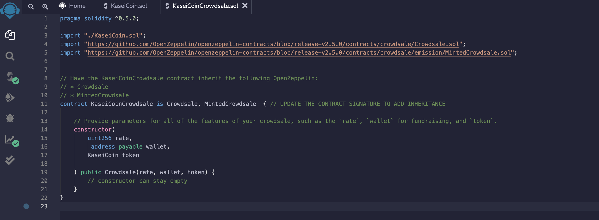

# Unit 21: Martian Token Crowdsale

## Background

After waiting for years and passing several tests, the Martian Aerospace Agency selected you to become part of the first human colony on Mars. As a prominent fintech professional, they chose you to lead a project developing a monetary system for the new Mars colony. You decided to base this new system on blockchain technology and to define a new cryptocurrency named **KaseiCoin**. (Kasei means Mars in Japanese.)

KaseiCoin will be a fungible token that’s ERC-20 compliant. You’ll launch a crowdsale that will allow people who are moving to Mars to convert their earthling money to KaseiCoin.

# KaseiCoin

<<<<<<< HEAD
=======
https://user-images.githubusercontent.com/95659816/169387617-7442adae-1714-47f1-9620-35863b17e50e.mov
## Video 2
https://user-images.githubusercontent.com/95659816/169574023-a60aaca8-b363-4fe7-b90a-fa3a4b5638de.mov
>>>>>>> 307f799a1b5bec235cad3ce2a2017db1723979c2

##Intereacting 

# Estension of the project

